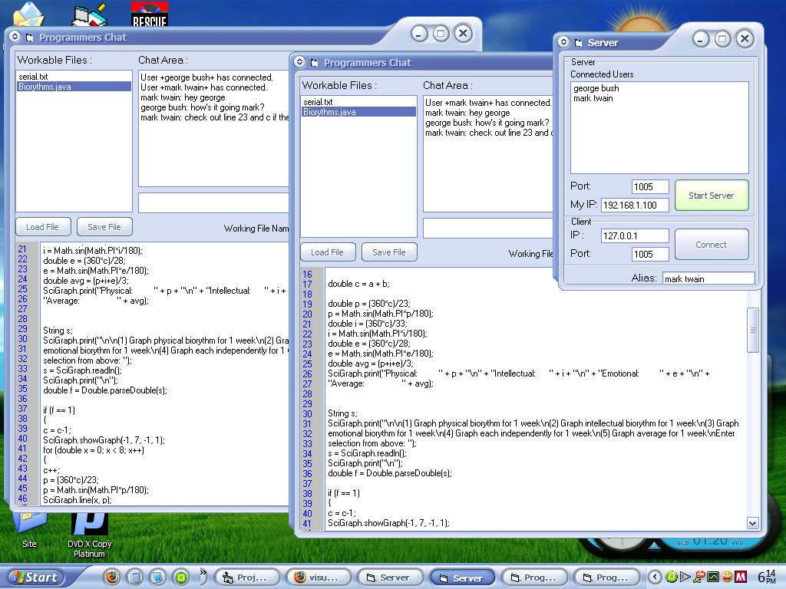

## Programmers Chat \[MAJOR UPDATES\]

### Description

This program combines the ability to chat with the added ability to share an unlimited number of text files with an unlimited number of people. This enables several developers to work on several files for one project - or even one file - at the same time.

Updates:

Shows youor IP to give to clients

Shows line numbers

Load/save files

User enter/exit notice in chat

Better naming for working files

Auto-Connect when starting server

How to use:

It should be pretty simple, but here's some instruction anyways.

1. Pick a host. Whoever is hosting needs to click the 'Start Server' button. You will be automatically connected. Give your ip to the clients. (WhatIsMyIp.com)

2. Clients will punch in the servers ip address and click connect. This will pop-up the chat window.

3. In the chat window, you have several fields. The top right area is for regular chatting. You can talk to everyone connected to the server. The left side shows all files currently being worked on. You can click on one of these files at anytime to load the current update on the file. Be sure to include a working file name when updating a file.

4. To start your own file or update a file, type a working file name and put in whatever file or text that you want to. When you have made an update you want others to see, click "Update" and all clients will have that file available to them.

Any questions/comments, please send a message/email to ajcis55@yahoo.com (or ajcis55 on YIM), or leave comments in PSC. Thanks for voting!
 
### More Info
 

             |
---                |---
**Submitted On**   |2006-04-24 18:22:32
**By**             |[cyb3r\_riot](https://github.com/Planet-Source-Code/PSCIndex/blob/master/ByAuthor/cyb3r-riot.md)
**Level**          |Intermediate
**User Rating**    |4.8 (19 globes from 4 users)
**Compatibility**  |VB 5\.0, VB 6\.0
**Category**       |[Complete Applications](https://github.com/Planet-Source-Code/PSCIndex/blob/master/ByCategory/complete-applications__1-27.md)
**World**          |[Visual Basic](https://github.com/Planet-Source-Code/PSCIndex/blob/master/ByWorld/visual-basic.md)
**Archive File**   |[Programmer1989694242006\.zip](https://github.com/Planet-Source-Code/cyb3r-riot-programmers-chat-major-updates__1-65092/archive/master.zip)

